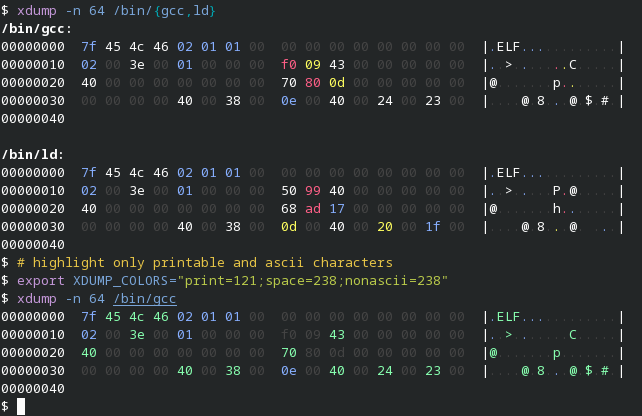

# xdump

The **xdump** utility is a filter which displays the specified file, or standard input if no file is specified, in hexadecimal and ASCII format. It uses a colored output to distinguish different categories of bytes.

The categories of bytes are:

+ NULL bytes
+ printable ASCII characters
+ ASCII whitespace characters
+ other ASCII characters
+ non-ASCII

The colors can be changed with the `XDUMP_COLORS` environment variable. Its value is a semicolon-separated list that defaults to `off=7;bar=7;nul=238;print=7;space=227;ascii=111;nonascii=204`. The color must be a valid [8-bit color](https://en.wikipedia.org/wiki/ANSI_escape_code#8-bit) code.

When the [`NO_COLOR` environment variable](https://no-color.org) is present or when the standard output isn't connected to a terminal, the colored output is disabled.

## Installation

### Arch Linux

[**xdump**](https://aur.archlinux.org/packages/xdump) package from AUR

```text
git clone https://aur.archlinux.org/xdump.git
cd xdump
makepkg -si
```

### Fedora Linux

[**xdump**](https://copr.fedorainfracloud.org/coprs/xfgusta/xdump/) package from Copr

```text
dnf copr enable xfgusta/xdump
dnf install xdump
```

### From source

The install directory defaults to `/usr/local`:

```text
make install
```

You can install **xdump** in a different directory using the `PREFIX` variable:

```text
make PREFIX=/usr install
```

## Screenshot



## License

Copyright (c) 2022 Gustavo Costa. Distributed under the MIT license.
